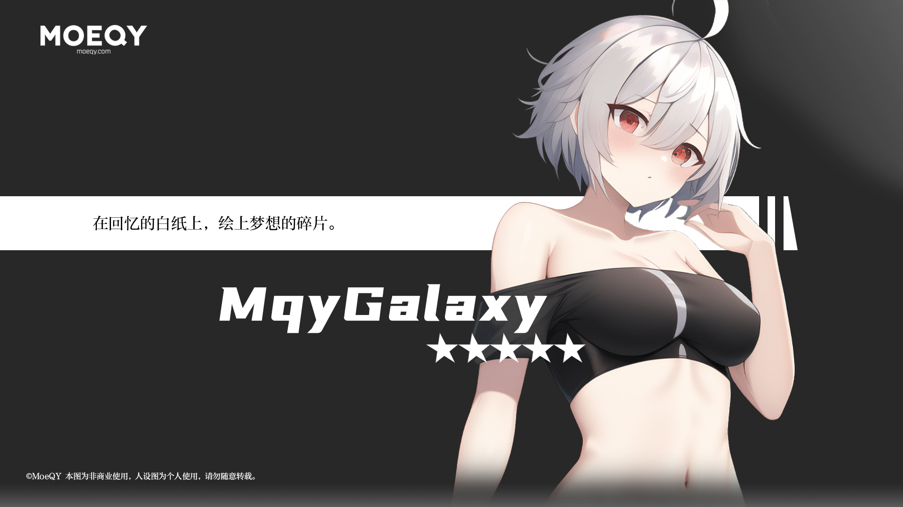

**🚨 最近正在忙于学业，如果您想联系我请通过我的邮箱联系。我会尽快回复！**

**🚨 I have been busy with my studies recently. If you want to contact me, please contact me through my email. I will reply as soon as possible!**

### 访客 | Visitors
您是第

来到我的主页的人。

欢迎到访我的主页吖！

-------

### 关于我 | About Me

  
  
  

我是 MqyGalaxy，一个爱好 ACGN 的普通人。平常做一些自己喜欢的东西。
一个小萌新，没有什么厉害的技术。逐渐发展自己！

### 我在研究的东西 | Learning

ps. 以上大部分内容均为自己摸索，需要才去学。半吊子一个qwq。

### 平台 | Platform

### 联系我 | Contact Me

### 我在玩的游戏 | Gaming

#### 原神 | Genshin Impact

#### 其他更多 | More

真想找我玩来私聊找我o(*￣▽￣*)o ~~不要嫌我菜QAQ~~
